<!-- ╔══════════════════════════════════════════════════════════════════════════╗ -->
<!-- ║                KARTIK RAIKAR • NEURAL COMMAND CENTER v2               ║ -->
<!-- ║         Custom Animated SVGs • Holographic 3D Cards • Tech Radar      ║ -->
<!-- ║       Boot Sequence • System Metrics • Circuit Dividers • HUD UI      ║ --> 
<!-- ╚══════════════════════════════════════════════════════════════════════════╝ -->
 
<!-- ═══════════════════ ANIMATED NEURAL NETWORK BANNER ═══════════════════ -->
<!-- Matrix rain • Hex grid • 25+ pulsing nodes • Sonar pulse • Glitch text -->
<div align="center">


</div>

<br/>

<!-- ═══════════════════ DYNAMIC COMMAND LINE STREAM ═══════════════════ -->

<div align="center">

<a href="https://git.io/typing-svg">
  
</a>

<br/>

<!-- ═══════════════════ QUICK-LINK HUD BADGES ═══════════════════ -->

<a href="https://kartikportfolio-eta.vercel.app/">
  
</a>
&nbsp;
<a href="https://linkedin.com/in/kartik-raikar-kr">
  
</a>
&nbsp;
<a href="mailto:kartikraikar2005@gmail.com">
  
</a>
&nbsp;
<a href="https://github.com/kartik-012">
  
</a>

<br/><br/>

<!-- LIVE SYSTEM COUNTERS -->

&nbsp;

&nbsp;

&nbsp;

&nbsp;


</div>

<br/>

<!-- ═══════════════════ CIRCUIT DIVIDER ═══════════════════ -->
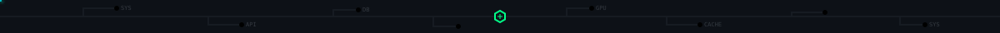

<!-- ╔══════════════════════════════════════════════════════════════════════════╗ -->
<!-- ║                     SYSTEM BOOT SEQUENCE                               ║ -->
<!-- ╚══════════════════════════════════════════════════════════════════════════╝ -->

<div align="center">

<a href="https://git.io/typing-svg">
  
</a>

<br/><br/>

<!-- ANIMATED TERMINAL BOOT SVG -->

</div>

<br/>

<!-- ═══════════════════ CIRCUIT DIVIDER ═══════════════════ -->


<!-- ╔══════════════════════════════════════════════════════════════════════════╗ -->
<!-- ║                      KERNEL MANIFEST                                   ║ -->
<!-- ╚══════════════════════════════════════════════════════════════════════════╝ -->

<div align="center">

<a href="https://git.io/typing-svg">
  
</a>

<br/><br/>

<!-- ANIMATED CYBERNETIC KERNEL MANIFEST CARD -->
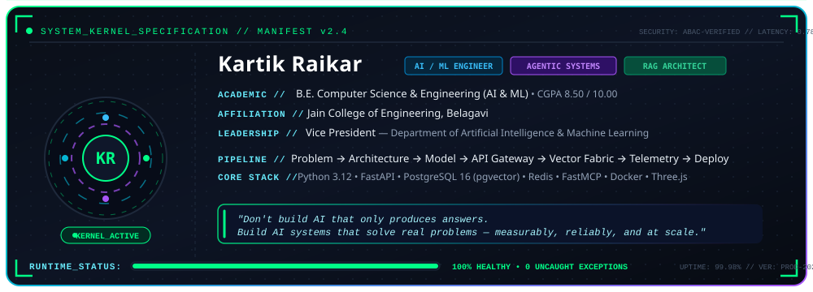

</div>

<br/>

<!-- ═══════════════════ CIRCUIT DIVIDER ═══════════════════ -->


<!-- ╔══════════════════════════════════════════════════════════════════════════╗ -->
<!-- ║                HOLOGRAPHIC 3D PROJECT CARDS                            ║ -->
<!-- ╚══════════════════════════════════════════════════════════════════════════╝ -->

<div align="center">

<a href="https://git.io/typing-svg">
  
</a>

<br/><br/>

<!-- 3D HOLOGRAPHIC PROJECT CARDS — 2x2 GRID -->
<table border="0" cellspacing="0" cellpadding="10">
<tr>
<td>
  <a href="https://github.com/kartik-012">
    
  </a>
</td>
<td>
  <a href="https://github.com/kartik-012">
    
  </a>
</td>
</tr>
<tr>
<td>
  <a href="https://github.com/kartik-012">
    
  </a>
</td>
<td>
  <a href="https://github.com/kartik-012">
    
  </a>
</td>
</tr>
</table>

</div>

<br/>

<!-- ═══════════════════ CIRCUIT DIVIDER ═══════════════════ -->


<!-- ╔══════════════════════════════════════════════════════════════════════════╗ -->
<!-- ║                  SYSTEM PERFORMANCE METRICS                            ║ -->
<!-- ╚══════════════════════════════════════════════════════════════════════════╝ -->

<div align="center">

<a href="https://git.io/typing-svg">
  
</a>

<br/><br/>

<!-- ANIMATED SYSTEM METRICS DASHBOARD SVG -->

</div>

<br/>

<!-- ═══════════════════ CIRCUIT DIVIDER ═══════════════════ -->


<!-- ╔══════════════════════════════════════════════════════════════════════════╗ -->
<!-- ║                 PRODUCTION SYSTEM ARCHITECTURE                         ║ -->
<!-- ╚══════════════════════════════════════════════════════════════════════════╝ -->

<div align="center">

<a href="https://git.io/typing-svg">
  
</a>

</div>

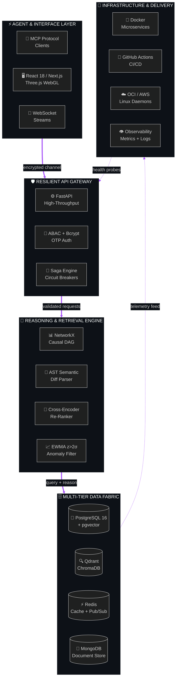

<br/>

<!-- ═══════════════════ CIRCUIT DIVIDER ═══════════════════ -->


<!-- ╔══════════════════════════════════════════════════════════════════════════╗ -->
<!-- ║                      TECHNOLOGY RADAR                                  ║ -->
<!-- ╚══════════════════════════════════════════════════════════════════════════╝ -->

<div align="center">

<a href="https://git.io/typing-svg">
  
</a>

<br/><br/>

<!-- ANIMATED TECH RADAR SVG — Rotating sweep • Pulsing dots • Connection lines -->

<br/><br/>

<!-- ═══════════════════ SKILL ICON MATRIX ═══════════════════ -->

**`LANGUAGES & CORE RUNTIME`**


<br/><br/>

**`AI / ML / GENERATIVE AI`**


<br/><br/>

**`BACKEND & INFRASTRUCTURE`**


<br/><br/>

**`DATABASES & VECTOR OPERATIONS`**


&nbsp;


<br/><br/>

**`FRONTEND & VISUAL COMPUTING`**


<br/><br/>

**`ML MATH & ANALYTICS`**


&nbsp;


</div>

<br/>

<!-- ═══════════════════ CIRCUIT DIVIDER ═══════════════════ -->


<!-- ╔══════════════════════════════════════════════════════════════════════════╗ -->
<!-- ║               ACHIEVEMENTS & CREDENTIALS HUD                          ║ -->
<!-- ╚══════════════════════════════════════════════════════════════════════════╝ -->

<div align="center">

<a href="https://git.io/typing-svg">
  
</a>

<br/><br/>

<!-- ANIMATED ACHIEVEMENT HUD PANEL SVG -->

</div>

<br/>

<!-- ═══════════════════ CIRCUIT DIVIDER ═══════════════════ -->


<!-- ╔══════════════════════════════════════════════════════════════════════════╗ -->
<!-- ║                    GITHUB INTELLIGENCE FEED                            ║ -->
<!-- ╚══════════════════════════════════════════════════════════════════════════╝ -->

<div align="center">

<a href="https://git.io/typing-svg">
  
</a>

<br/><br/>

<!-- SELF-HOSTED ANIMATED GITHUB ANALYTICS MATRIX (0% Rate Limit Risk • 100% Uptime) -->

<br/><br/>

<!-- COMPACT LIVE TELEMETRY STREAK -->


</div>

<br/>

<!-- ═══════════════════ CIRCUIT DIVIDER ═══════════════════ -->


<!-- ╔══════════════════════════════════════════════════════════════════════════╗ -->
<!-- ║                     ACTIVE MISSION BRIEF                               ║ -->
<!-- ╚══════════════════════════════════════════════════════════════════════════╝ -->

<div align="center">

<a href="https://git.io/typing-svg">
  
</a>

</div>

```
┌───────────────────────────────────────────────────────────────────────────────┐
│  MISSION 01  ░░░░░░░  AI Agent Architecture                                 │
│              ████████████████████░░░░░░░░░░░░░░░░░░░░░░░░░  ACTIVE          │
│              Tool calling · Multi-step workflows · Context persistence      │
├───────────────────────────────────────────────────────────────────────────────┤
│  MISSION 02  ░░░░░░░  Advanced RAG Systems                                  │
│              ██████████████████████████░░░░░░░░░░░░░░░░░░░  ACTIVE          │
│              Version-partitioned vectors · AST diffing · HNSW tuning       │
├───────────────────────────────────────────────────────────────────────────────┤
│  MISSION 03  ░░░░░░░  Model Context Protocol                                │
│              █████████████████████████████░░░░░░░░░░░░░░░░  IN PROGRESS     │
│              Fault-tolerant MCP servers · Saga execution patterns          │
├───────────────────────────────────────────────────────────────────────────────┤
│  MISSION 04  ░░░░░░░  AI Evaluation & Reliability                           │
│              ████████████████████████████████████░░░░░░░░░  ADVANCED        │
│              Hallucination measurement · Cross-encoder benchmarking        │
├───────────────────────────────────────────────────────────────────────────────┤
│  MISSION 05  ░░░░░░░  Production Backend Systems                            │
│              ██████████████████████████████████████░░░░░░░  ADVANCED        │
│              High-throughput APIs · Caching · Containers · Observability   │
├───────────────────────────────────────────────────────────────────────────────┤
│  MISSION 06  ░░░░░░░  Cloud Architecture & MLOps                            │
│              ███████████████████░░░░░░░░░░░░░░░░░░░░░░░░░  BUILDING        │
│              CI/CD pipelines · Experiment tracking · Model deployment      │
└───────────────────────────────────────────────────────────────────────────────┘
```

<br/>

<!-- ═══════════════════ CIRCUIT DIVIDER ═══════════════════ -->


<!-- ╔══════════════════════════════════════════════════════════════════════════╗ -->
<!-- ║                      LEARNING TRAJECTORY                               ║ -->
<!-- ╚══════════════════════════════════════════════════════════════════════════╝ -->

<div align="center">

<a href="https://git.io/typing-svg">
  
</a>

</div>

```mermaid
%%{init: {'theme':'dark', 'themeVariables': { 'primaryColor': '#161b22', 'primaryTextColor': '#e6edf3', 'primaryBorderColor': '#a855f7', 'lineColor': '#00ff88', 'secondaryColor': '#0d1117', 'tertiaryColor': '#0d1117'}}}%%

flowchart LR
    A["🎯 Prompt\nEngineering"] --> B["⚡ AI Agent\nArchitecture"]
    B --> C["🔗 LangGraph\n& LangChain"]
    C --> D["🔌 Model Context\nProtocol"]
    D --> E["🔍 Vector\nDatabases"]
    E --> F["☸️ Kubernetes"]
    F --> G["☁️ Cloud\nArchitecture"]
    G --> H["🔧 CI/CD\nPipelines"]
    H --> I["🌐 Distributed\nSystems"]

    style A fill:#0d1117,stroke:#00ff88,stroke-width:2px,color:#e6edf3
    style B fill:#0d1117,stroke:#00ff88,stroke-width:2px,color:#e6edf3
    style C fill:#0d1117,stroke:#a855f7,stroke-width:2px,color:#e6edf3
    style D fill:#0d1117,stroke:#a855f7,stroke-width:2px,color:#e6edf3
    style E fill:#0d1117,stroke:#06b6d4,stroke-width:2px,color:#e6edf3
    style F fill:#0d1117,stroke:#06b6d4,stroke-width:2px,color:#e6edf3
    style G fill:#0d1117,stroke:#f59e0b,stroke-width:2px,color:#e6edf3
    style H fill:#0d1117,stroke:#f59e0b,stroke-width:2px,color:#e6edf3
    style I fill:#0d1117,stroke:#f43f5e,stroke-width:2px,color:#e6edf3
```

<br/>

<!-- ═══════════════════ CIRCUIT DIVIDER ═══════════════════ -->


<!-- ╔══════════════════════════════════════════════════════════════════════════╗ -->
<!-- ║                    OPPORTUNITY MATRIX                                   ║ -->
<!-- ╚══════════════════════════════════════════════════════════════════════════╝ -->

<div align="center">

<a href="https://git.io/typing-svg">
  
</a>

<br/><br/>


<br/>


</div>

<br/>

<!-- ═══════════════════ CIRCUIT DIVIDER ═══════════════════ -->


<!-- ╔══════════════════════════════════════════════════════════════════════════╗ -->
<!-- ║                    CONNECT / DISPATCH                                   ║ -->
<!-- ╚══════════════════════════════════════════════════════════════════════════╝ -->

<div align="center">

<a href="https://git.io/typing-svg">
  
</a>

<br/><br/>

> *Building high-scale Agent architectures, sub-second RAG indices,*
> *or next-gen AI engineering infrastructure?*
> ***Let's build something that matters.***

<br/>

<a href="mailto:kartikraikar2005@gmail.com">
  
</a>
&nbsp;
<a href="https://linkedin.com/in/kartik-raikar-kr">
  
</a>
&nbsp;
<a href="https://kartikportfolio-eta.vercel.app/">
  
</a>
&nbsp;
<a href="https://github.com/kartik-012">
  
</a>

<br/><br/>

<!-- TERMINAL EXIT STREAM -->
<a href="https://git.io/typing-svg">
  
</a>

<br/><br/>

<!-- ═══════════════════ ANIMATED FOOTER SVG ═══════════════════ -->

</div>
