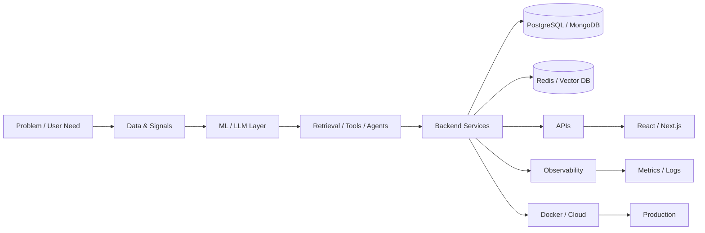

<!-- ========================================================= -->
<!--             KARTIK RAIKAR • PREMIUM PROFILE               -->
<!-- ========================================================= -->

<div align="center">

<!-- ========================= HERO ========================== -->


<br/>


<br/><br/>

<!-- ====================== PRIMARY CTA ====================== -->

<a href="https://kartik-012.github.io">
  
</a>
&nbsp;
<a href="https://github.com/kartik-012">
  
</a>
&nbsp;
<a href="https://linkedin.com/in/kartik-raikar-kr">
  
</a>
&nbsp;
<a href="mailto:kartikraikar2005@gmail.com">
  
</a>

<br/><br/>

<!-- ===================== LIVE METRICS ====================== -->


&nbsp;

&nbsp;


</div>

<br/>

---

<!-- ========================================================= -->
<!--                      NAVIGATION                           -->
<!-- ========================================================= -->

<div align="center">

### `SYSTEM NAVIGATION`

<a href="#01--about">ABOUT</a>
&nbsp;•&nbsp;
<a href="#02--architecture">ARCHITECTURE</a>
&nbsp;•&nbsp;
<a href="#03--what-i-build">WHAT I BUILD</a>
&nbsp;•&nbsp;
<a href="#04--featured-builds">BUILDS</a>
&nbsp;•&nbsp;
<a href="#05--technology-stack">STACK</a>
&nbsp;•&nbsp;
<a href="#09--github-intelligence">ANALYTICS</a>
&nbsp;•&nbsp;
<a href="#12--engineering-philosophy">PHILOSOPHY</a>
&nbsp;•&nbsp;
<a href="#15--connect">CONNECT</a>

</div>

<br/>

<!-- ========================================================= -->
<!--                    TERMINAL INTRO                         -->
<!-- ========================================================= -->

<div align="center">

<table>
<tr>
<td>

```text
┌──────────────────────────────────────────────────────────────┐
│                 KARTIK • AI ENGINEERING WORKSPACE            │
├──────────────────────────────────────────────────────────────┤
│                                                              │
│  $ whoami                                                     │
│                                                              │
│  Kartik Raikar                                                │
│                                                              │
│  > AI / ML Engineer                                           │
│  > Full-Stack Developer                                       │
│  > Generative AI Builder                                      │
│  > Backend & Systems Enthusiast                               │
│                                                              │
│  $ current_mission                                            │
│                                                              │
│  Build intelligent software that connects AI, data,          │
│  backend engineering, infrastructure and product UX.         │
│                                                              │
│  $ system_status                                              │
│                                                              │
│  [✓] AI PIPELINES                                             │
│  [✓] RETRIEVAL SYSTEMS                                        │
│  [✓] BACKEND SERVICES                                         │
│  [✓] DATA SYSTEMS                                             │
│  [✓] FRONTEND EXPERIENCES                                     │
│  [✓] CONTAINERIZED DEPLOYMENT                                 │
│                                                              │
└──────────────────────────────────────────────────────────────┘
```

</td>
</tr>
</table>

</div>

<br/>

<!-- ========================================================= -->
<!--                         ABOUT                             -->
<!-- ========================================================= -->

<a name="01--about"></a>

# `01` — About Me

<table>
<tr>

<td width="58%" valign="top">

### 👋 AI × Software × Systems

I'm a **B.E. Artificial Intelligence & Machine Learning student** focused on building practical and production-oriented AI systems.

I enjoy taking an idea through the complete engineering lifecycle:

**Problem → Architecture → Model → API → Data → Interface → Deployment**

My interests sit at the intersection of:

- 🤖 Artificial Intelligence
- 🧠 Large Language Models
- 📚 Retrieval-Augmented Generation
- ⚡ AI Agents
- 🧪 Machine Learning
- 🌐 Full-Stack Development
- 🏗️ Backend & API Engineering
- 🗄️ Databases & Vector Search
- ☁️ Cloud & Infrastructure
- 📊 Data & Analytics

I care about more than getting a model to produce an output.

I want the **system around the model** to be useful, measurable, reliable, secure and deployable.

</td>

<td width="42%" valign="top">

### `ENGINEERING PROFILE`

```text
┌─────────────────────────────┐
│ ROLE                        │
│ AI / ML Engineer            │
├─────────────────────────────┤
│ PRIMARY LANGUAGE            │
│ Python                      │
├─────────────────────────────┤
│ AI                         │
│ LLMs • RAG • Agents • ML   │
├─────────────────────────────┤
│ BACKEND                    │
│ FastAPI • APIs             │
├─────────────────────────────┤
│ DATA                       │
│ PostgreSQL • MongoDB       │
│ Redis • Vector Search      │
├─────────────────────────────┤
│ FRONTEND                   │
│ React • Next.js            │
├─────────────────────────────┤
│ INFRA                      │
│ Docker • Linux • Cloud     │
└─────────────────────────────┘
```

</td>

</tr>
</table>

<br/>

<!-- ========================================================= -->
<!--                    ENGINEERING MINDSET                    -->
<!-- ========================================================= -->

<div align="center">

## `HOW I APPROACH ENGINEERING`

<table>
<tr>

<td align="center" width="16%">

### `01`

🔍

**UNDERSTAND**

</td>

<td align="center" width="16%">

### `02`

🏗️

**ARCHITECT**

</td>

<td align="center" width="16%">

### `03`

🧠

**BUILD**

</td>

<td align="center" width="16%">

### `04`

📏

**EVALUATE**

</td>

<td align="center" width="16%">

### `05`

⚙️

**OPTIMIZE**

</td>

<td align="center" width="16%">

### `06`

🚀

**SHIP**

</td>

</tr>
</table>

</div>

<br/>

---

<!-- ========================================================= -->
<!--                      ARCHITECTURE                         -->
<!-- ========================================================= -->

<a name="02--architecture"></a>

# `02` — Architecture

<div align="center">

### From a problem statement to a production AI system

</div>



<br/>

<div align="center">

### `THE SYSTEM LOOP`


</div>

<br/>

---

<!-- ========================================================= -->
<!--                    WHAT I BUILD                           -->
<!-- ========================================================= -->

<a name="03--what-i-build"></a>

# `03` — What I Build

<div align="center">

<table>

<tr>

<td align="center" width="25%">

## 🤖

### AI APPLICATIONS

LLM-powered products

Intelligent workflows

AI interfaces

</td>

<td align="center" width="25%">

## 📚

### RETRIEVAL SYSTEMS

RAG

Embeddings

Semantic Search

Vector Retrieval

</td>

<td align="center" width="25%">

## ⚡

### AGENT SYSTEMS

Tool Calling

Multi-step workflows

Agentic architecture

</td>

<td align="center" width="25%">

## 🏗️

### AI INFRASTRUCTURE

APIs

Databases

Caching

Containers

</td>

</tr>

</table>

</div>

<br/>

<!-- ========================================================= -->
<!--                    FEATURED BUILDS                        -->
<!-- ========================================================= -->

<a name="04--featured-builds"></a>

# `04` — Featured Builds

<div align="center">

### Selected systems and engineering experiments

</div>

<br/>

<!-- ========================= ATLAS ========================= -->

<table>

<tr>

<td width="50%" valign="top">

## 🧠 AtlasOS

### `AI MEMORY OPERATING SYSTEM`


<br/><br/>

A production-oriented AI memory architecture designed around structured long-term context.

### Core Architecture

- Working memory
- Episodic memory
- Semantic memory
- Hierarchical memory
- Vector retrieval
- Multi-tenant architecture
- PostgreSQL Row-Level Security
- Redis
- Background processing
- Dockerized infrastructure

### Design Goal

> Build AI systems capable of maintaining useful long-term context.

</td>

<td width="50%" valign="top">

## 🧪 RagaAI Catalyst

### `ENTERPRISE LLM EVALUATION PLATFORM`


<br/><br/>

An AI evaluation platform designed to compare and analyze outputs from modern language models.

### Evaluation Dimensions

- 🎯 Correctness
- 📚 Faithfulness
- 🔎 Relevance
- 🛡️ Toxicity
- 📊 Model comparison
- 📈 Evaluation analytics

### Design Goal

> Make AI quality measurable instead of relying only on intuition.

</td>

</tr>

<!-- ========================== DEBATE ======================= -->

<tr>

<td width="50%" valign="top">

## ⚔️ AI Debate Arena

### `MULTI-MODEL INTERACTION`


<br/><br/>

A multi-model AI environment where different language models participate in structured discussions and their responses can be compared.

### Focus

- Multi-model interaction
- Structured reasoning
- Response comparison
- AI evaluation
- Interactive user experience

</td>

<td width="50%" valign="top">

## 🔬 Systems Engineering

### `AI + SOFTWARE + INFRASTRUCTURE`

I like projects where the engineering challenge extends beyond the model itself.

```text
┌───────────────┐
│   AI MODELS   │
└───────┬───────┘
        ↓
┌───────────────┐
│   RETRIEVAL   │
└───────┬───────┘
        ↓
┌───────────────┐
│   DATA LAYER  │
└───────┬───────┘
        ↓
┌───────────────┐
│      API      │
└───────┬───────┘
        ↓
┌───────────────┐
│      UI       │
└───────┬───────┘
        ↓
┌───────────────┐
│ INFRASTRUCTURE│
└───────────────┘
```

</td>

</tr>

</table>

<br/>

<!-- ========================================================= -->
<!--                    PROJECT DNA                            -->
<!-- ========================================================= -->

<div align="center">

## `PROJECT DNA`

<table>

<tr>

<td align="center" width="20%">

🔒

### SECURITY

Isolation

Access control

Data boundaries

</td>

<td align="center" width="20%">

📊

### EVALUATION

Quality

Correctness

Reliability

</td>

<td align="center" width="20%">

⚙️

### ENGINEERING

APIs

Databases

Architecture

</td>

<td align="center" width="20%">

📈

### SCALE

Caching

Queues

Optimization

</td>

<td align="center" width="20%">

👁️

### OBSERVABILITY

Metrics

Logs

Tracing

</td>

</tr>

</table>

</div>

<br/>

---

<!-- ========================================================= -->
<!--                  TECHNOLOGY STACK                         -->
<!-- ========================================================= -->

<a name="05--technology-stack"></a>

# `05` — Technology Stack

<div align="center">

### Technologies I use across the AI engineering lifecycle

<br/>

## `LANGUAGES`


<br/><br/>

## `AI / MACHINE LEARNING`


<br/><br/>


<br/><br/>

## `FRONTEND`


<br/><br/>

## `BACKEND`


<br/><br/>

## `DATABASES & DATA`


<br/><br/>


<br/><br/>

## `DEVOPS & INFRASTRUCTURE`


<br/><br/>


<br/><br/>

## `TOOLS`


<br/><br/>


</div>

<br/>

---

<!-- ========================================================= -->
<!--                ENGINEERING SURFACE                        -->
<!-- ========================================================= -->

<div align="center">

# `06` — Engineering Surface

<table>

<tr>

<td align="center" width="25%">

### 🤖 AI

LLMs

Generative AI

Agents

NLP

Transformers

</td>

<td align="center" width="25%">

### 🔎 RETRIEVAL

RAG

Embeddings

Semantic Search

Vector Databases

Grounding

</td>

<td align="center" width="25%">

### 🏗️ SYSTEMS

APIs

Backend

Databases

Caching

Distributed Systems

</td>

<td align="center" width="25%">

### 🚀 DELIVERY

Docker

Linux

Cloud

CI/CD

MLOps

</td>

</tr>

</table>

</div>

<br/>

---

<!-- ========================================================= -->
<!--                       CORE AI                             -->
<!-- ========================================================= -->

# `07` — Core AI Interests

<div align="center">

| Domain | What I Explore |
|---|---|
| 🤖 Generative AI | LLM-powered applications |
| 📚 RAG | Retrieval, grounding, semantic search |
| ⚡ AI Agents | Tools, workflows, agentic systems |
| 🧠 NLP | Transformers and language models |
| 🧪 Machine Learning | Training, inference and evaluation |
| 🔎 Vector Search | Embeddings and vector databases |
| 📊 Evaluation | Quality, correctness and reliability |
| 🏗️ AI Systems | Production-oriented AI architecture |

</div>

<br/>

---

<!-- ========================================================= -->
<!--                     CURRENT FOCUS                         -->
<!-- ========================================================= -->

# `08` — Current Focus

<div align="center">


</div>

<br/>

<table>

<tr>

<td width="50%" valign="top">

### `01` — AI Agents

Designing systems capable of using tools, maintaining context and executing multi-step workflows.

### `02` — LLM Applications

Building applications where language models are integrated into real product workflows.

### `03` — Retrieval-Augmented Generation

Working with retrieval, embeddings, semantic search, vector stores and grounded context.

</td>

<td width="50%" valign="top">

### `04` — AI Evaluation

Exploring how correctness, faithfulness, relevance and reliability can be measured.

### `05` — Production Engineering

APIs, databases, caching, containers, observability, scalability and deployment.

### `06` — MLOps

Building repeatable workflows for experimentation, deployment, monitoring and iteration.

</td>

</tr>

</table>

<br/>

---

<!-- ========================================================= -->
<!--                    LEARNING PIPELINE                      -->
<!-- ========================================================= -->

<div align="center">

# `09` — Learning Pipeline

```text
PROMPT ENGINEERING
        ↓
AI AGENT ARCHITECTURE
        ↓
LANGGRAPH
        ↓
LANGCHAIN
        ↓
MODEL CONTEXT PROTOCOL
        ↓
VECTOR DATABASES
        ↓
KUBERNETES
        ↓
CLOUD ARCHITECTURE
        ↓
CI / CD
        ↓
DISTRIBUTED SYSTEMS
```

</div>

<br/>

---

<!-- ========================================================= -->
<!--                  GITHUB INTELLIGENCE                      -->
<!-- ========================================================= -->

<a name="09--github-intelligence"></a>

# `10` — GitHub Intelligence

<div align="center">

### Live repository activity

<br/>


<br/><br/>

<table>

<tr>

<td width="50%">


</td>

<td width="50%">


</td>

</tr>

</table>

<br/>


<br/><br/>


</div>

<br/>

---

<!-- ========================================================= -->
<!--                    3D CONTRIBUTIONS                       -->
<!-- ========================================================= -->

# `11` — 3D Contribution Layer

<div align="center">

### Contribution history — rendered in 3D

<br/>

<picture>

  <source
    media="(prefers-color-scheme: dark)"
    srcset="./profile-3d-contrib/profile-night-rainbow.svg"
  />

  <source
    media="(prefers-color-scheme: light)"
    srcset="./profile-3d-contrib/profile-green-animate.svg"
  />

  

</picture>

</div>

<br/>

---

<!-- ========================================================= -->
<!--                    CONTRIBUTION SNAKE                     -->
<!-- ========================================================= -->

# `12` — Contribution Motion

<div align="center">

### Every contribution becomes part of the system.

<br/>

<picture>

  <source
    media="(prefers-color-scheme: dark)"
    srcset="https://raw.githubusercontent.com/kartik-012/kartik-012/output/github-contribution-grid-snake-dark.svg"
  />

  <source
    media="(prefers-color-scheme: light)"
    srcset="https://raw.githubusercontent.com/kartik-012/kartik-012/output/github-contribution-grid-snake.svg"
  />

  

</picture>

</div>

<br/>

---

<!-- ========================================================= -->
<!--                  ENGINEERING PHILOSOPHY                   -->
<!-- ========================================================= -->

<a name="12--engineering-philosophy"></a>

# `13` — Engineering Philosophy

<div align="center">

## `BUILD → MEASURE → IMPROVE → REPEAT`

<br/>

<table>

<tr>

<td align="center" width="20%">

### RELIABLE

Systems should behave predictably.

</td>

<td align="center" width="20%">

### OBSERVABLE

Systems should explain what is happening.

</td>

<td align="center" width="20%">

### SCALABLE

Good ideas should survive growth.

</td>

<td align="center" width="20%">

### SECURE

Data and access boundaries matter.

</td>

<td align="center" width="20%">

### USEFUL

Technology should solve something real.

</td>

</tr>

</table>

<br/>

> ### “I don't want to build AI that only produces answers.”
> ### “I want to build AI systems that solve problems.”

</div>

<br/>

---

<!-- ========================================================= -->
<!--                     BUILD STANDARD                       -->
<!-- ========================================================= -->

# `14` — My Build Standard

<div align="center">

```text
                       ┌─────────────────────┐
                       │     REAL PROBLEM    │
                       └──────────┬──────────┘
                                  │
                                  ▼
                       ┌─────────────────────┐
                       │     ARCHITECTURE    │
                       └──────────┬──────────┘
                                  │
                                  ▼
                       ┌─────────────────────┐
                       │    IMPLEMENTATION   │
                       └──────────┬──────────┘
                                  │
                                  ▼
                       ┌─────────────────────┐
                       │      EVALUATION     │
                       └──────────┬──────────┘
                                  │
                                  ▼
                       ┌─────────────────────┐
                       │    OBSERVABILITY    │
                       └──────────┬──────────┘
                                  │
                                  ▼
                       ┌─────────────────────┐
                       │     DEPLOYMENT      │
                       └──────────┬──────────┘
                                  │
                                  ▼
                       ┌─────────────────────┐
                       │      ITERATION      │
                       └─────────────────────┘
```

</div>

<br/>

---

<!-- ========================================================= -->
<!--                       OPEN TO                             -->
<!-- ========================================================= -->

# `15` — Open To

<div align="center">

<table>

<tr>

<td align="center" width="25%">

🤖

### AI ENGINEERING

</td>

<td align="center" width="25%">

🧠

### GENERATIVE AI

</td>

<td align="center" width="25%">

📊

### DATA SCIENCE

</td>

<td align="center" width="25%">

💻

### SOFTWARE ENGINEERING

</td>

</tr>

<tr>

<td align="center" width="25%">

📚

### AI RESEARCH

</td>

<td align="center" width="25%">

⚡

### RAG / AGENTS

</td>

<td align="center" width="25%">

🌐

### FULL-STACK AI

</td>

<td align="center" width="25%">

🌱

### OPEN SOURCE

</td>

</tr>

</table>

</div>

<br/>

---

<!-- ========================================================= -->
<!--                         CONNECT                           -->
<!-- ========================================================= -->

<a name="15--connect"></a>

# `16` — Connect

<div align="center">

### Let's build something intelligent.

<br/>

<a href="mailto:kartikraikar2005@gmail.com">
  
</a>
&nbsp;
<a href="https://linkedin.com/in/kartik-raikar-kr">
  
</a>
&nbsp;
<a href="https://github.com/kartik-012">
  
</a>
&nbsp;
<a href="https://kartikportfolio-eta.vercel.app/">
  
</a>

<br/><br/><br/>


<br/><br/>


</div>
```
